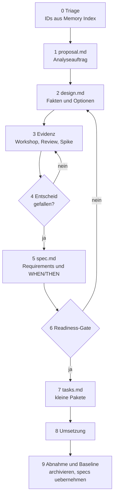

# OpenSpec-Prozess-Leitfaden: Vom ersten Proposal bis zum Task-Abschluss

**Status:** Arbeitsvorschlag fuer die interne Steuerung der Requirements-Engineering-Phase.
**Zweck:** Ein **schrittweiser, einfach vermittelbarer** Leitfaden fuer das ganze Team. Er zeigt den vollstaendigen Weg einer Anforderung: vom ersten `proposal.md` bis zum abgeschlossenen, abgenommenen Task.
**Fuer wen:** Success Lead / PO, Architekt, Entwickler. Kein OpenSpec-Vorwissen noetig.
**Gilt fuer:** alle Analyse-Workstreams dieses Mandats.

---

## Das Grundprinzip in drei Saetzen

1. **Der Mensch entscheidet, AI entwirft, die CLI validiert.** AI trifft nie einen Fachentscheid; sie formuliert nur Entwuerfe, die der Mensch bestaetigt.
2. **Keine Anforderung ohne Quelle.** Jede Aussage in einer Spec referenziert eine ID aus dem Memory Index (`UC-`, `FA-`, `NFA-`, `OP-`) oder einen dokumentierten Entscheid.
3. **Unsicheres bleibt sichtbar.** Offene Fragen (`F-`) und Konflikte (`K-`) werden festgehalten, nicht stillschweigend als Anforderung getarnt.

> Faustregel zum Merken: **Erst verstehen (proposal), dann entscheiden (design), dann festschreiben (spec), dann bauen (tasks).**

---

## Ueberblick: die 10 Schritte



Lies das Diagramm so: Es geht **von oben nach unten**. Zwei Stellen koennen zuruecklaufen — wenn ein Entscheid fehlt (Schritt 4) oder wenn die Readiness nicht erreicht ist (Schritt 6). Alles andere laeuft geradeaus.

---

## Wer macht was (Spickzettel)

| Rolle | Aufgabe in einem Satz |
|---|---|
| **Success Lead / PO** | Steuert Scope, organisiert Workshops, pflegt Traceability und Entscheidungslog, betreibt das Readiness-Gate. |
| **Architekt** | Bewertet Optionen, bestaetigt Requirements, verantwortet die fachliche/technische Richtigkeit. |
| **Entwickler** | Fuehrt Spikes aus, prueft Testbarkeit, setzt Tasks um. |
| **AI (Copilot)** | Entwirft Text fuer proposal/design/spec/tasks; implementiert gegen Szenarien. **Entscheidet nichts.** |
| **CLI (`openspec`)** | Legt Geruest an (`new`), zeigt Schablonen (`instructions`), zeigt Fortschritt (`status`), prueft die Form (`validate --strict`). **Schreibt nie Inhalt, urteilt nie fachlich.** |

> [!IMPORTANT] `instructions <artefakt>` erzeugt **nichts** — es zeigt nur die **Schablone**, wie die Datei auszusehen hat. Das gilt fuer `proposal`, `specs` und `tasks` gleichermassen. Den **Inhalt schreibt immer Copilot** (liest die Quelle, fuellt die Datei). Eselsbruecke: **`instructions` = Schablone · `status` = was fehlt · `validate` = Form ok? — Inhalt = Copilot.**

---

## Die 10 Schritte im Detail

Jeder Schritt nennt: **Ziel · Wer · Was tun · Befehl · Fertig, wenn.** Platzhalter `<CHANGE>` = der Change-Name des Workstreams (typischerweise der `<slug>` des Workstreams, ohne festen Produktprefix).

### Schritt 0 — Triage

- **Ziel:** Wissen, welche Anforderungen ins Thema gehoeren und welche zuerst geklaert werden muessen.
- **Wer:** Success Lead (Architekt unterstuetzt).
- **Was tun:** Die relevanten `UC-`/`FA-`/`NFA-`/`OP-`-IDs aus dem Memory Index sammeln und je ID als `klar`, `Luecke`, `Konflikt` oder `nachgelagert` markieren. Zugehoerige `F-`/`K-` notieren.
- **Befehl:** keiner (Arbeitsliste im Workstream-Dokument oder Ticket-Tool).
- **Fertig, wenn:** Eine Arbeitsliste existiert, in der jede ID einen Status und eine naechste Aktivitaet hat.

### Schritt 1 — `proposal.md` erfassen (Analyseauftrag)

- **Ziel:** In einem Satz festhalten, **welches Ergebnis** der Analyse-Change liefern soll — noch keine Loesung.
- **Wer:** Success Lead schreibt, AI entwirft, Architekt liest gegen.
- **Was tun:** Change anlegen; `proposal.md` mit `Why`, `What Changes`, `Capabilities` fuellen. Es beschreibt das Analyseziel, nicht die fertige Loesung.
- **Befehl:**
  ```powershell
  cd openspec-sdd
  npx --yes @fission-ai/openspec@latest new change <CHANGE>
  npx --yes @fission-ai/openspec@latest instructions proposal --change <CHANGE>
  ```
- **Fertig, wenn:** `proposal.md` das Ziel abgrenzt und die betroffenen IDs nennt, ohne eine Option vorwegzunehmen.

**Der eine Satz** (Analyseziel) folgt dem Muster: *"[entscheidungsreife oder testbare] Spezifikation fuer [die konkreten offenen Punkte] erarbeiten"* — also *was rauskommt* + *worueber*, noch keine Loesung.

### Schritt 2 — `design.md`: Fakten und Optionen sammeln

- **Ziel:** Den Loesungsraum sichtbar machen — belegte Fakten von offenen Optionen trennen.
- **Wer:** AI entwirft aus Grundlagen-/Workstream-Datei und Memory Index, Architekt/Success Lead reviewen.
- **Was tun:** `design.md` mit Kontext (belegte Fakten, IDs), Optionen/Varianten (Vor-/Nachteile), und offenen Entscheidungsbereichen fuellen.
- **Befehl:** `npx --yes @fission-ai/openspec@latest status --change <CHANGE>` (zeigt, was in diesem Change noch fehlt).
- **Fertig, wenn:** Jede im Triage-Schritt als Kernumfang markierte ID entweder als belegte Tatsache oder als offener Entscheidungsbereich in `design.md` auftaucht.

### Schritt 3 — Evidenz sammeln (Workshop / Review / Spike)

- **Ziel:** Die in Schritt 2 offen gebliebenen Entscheidungsbereiche mit externer Evidenz (Workshop, Fachreview, technischer Spike) fuellen.
- **Wer:** Success Lead organisiert, Architekt/Entwickler/externe Stakeholder liefern Evidenz.
- **Was tun:** Workshop/Review/Spike durchfuehren; Ergebnisse dokumentieren (z. B. als Ergaenzung in `design.md` oder als separates Evidenz-Dokument).
- **Befehl:** keiner (organisatorischer Schritt); optional Export einer Slidev-Praesentation, eines ausformulierten `design.md` oder einer Triage-Kopie fuer den Workshop.
- **Fertig, wenn:** Zu jedem offenen Entscheidungsbereich liegt genug Evidenz vor, um in Schritt 4 einen Entscheid zu faellen.

### Schritt 4 — Entscheid dokumentieren

- **Ziel:** Aus den Optionen/der Evidenz einen verbindlichen Entscheid ableiten.
- **Wer:** Architekt/Success Lead entscheiden; AI dokumentiert den Entscheid in `design.md`.
- **Was tun:** Entscheid + Begruendung in `design.md` ergaenzen (z. B. Abschnitt "Decisions").
- **Befehl:** keiner.
- **Fertig, wenn:** Ein dokumentierter, vom Team bestaetigter Entscheid vorliegt. **Kein Entscheid moeglich -> zurueck zu Schritt 3** (weitere Evidenz sammeln).

### Schritt 5 — `spec.md`: Requirements festschreiben

- **Ziel:** Die Entscheide aus Schritt 4 in testbare Requirements (Szenarien, WHEN/THEN) uebersetzen.
- **Wer:** AI entwirft aus `design.md`, Architekt bestaetigt.
- **Was tun:** `spec.md` gemaess Schablone fuellen; jedes Requirement referenziert eine ID/einen Entscheid.
- **Befehl:**
  ```powershell
  npx --yes @fission-ai/openspec@latest instructions specs --change <CHANGE>
  npx --yes @fission-ai/openspec@latest validate --change <CHANGE> --strict
  ```
- **Fertig, wenn:** `validate --strict` die Struktur bestaetigt und jedes Requirement auf einen Entscheid/eine ID rueckverfolgbar ist.

### Schritt 6 — Readiness-Gate

- **Ziel:** Sicherstellen, dass die Spec sprintreif ist, bevor Tasks abgeleitet werden.
- **Wer:** Success Lead betreibt das Gate, Architekt/Entwickler pruefen Testbarkeit.
- **Was tun:** `spec.md` gegen die Readiness-Kriterien pruefen (vollstaendig, widerspruchsfrei, testbar).
- **Befehl:** `npx --yes @fission-ai/openspec@latest validate --change <CHANGE> --strict`
- **Fertig, wenn:** Alle Kriterien erfuellt. **Nicht erfuellt -> zurueck zu Schritt 2** (design.md schaerfen), nicht sprintreife Punkte bleiben vermerkt.

### Schritt 7 — `tasks.md` zerlegen

- **Ziel:** Die Spec in kleine, umsetzbare Arbeitspakete zerlegen.
- **Wer:** AI entwirft, Entwickler bestaetigt Schnitt/Aufwand.
- **Was tun:** `tasks.md` gemaess Schablone fuellen; jeder Task referenziert das zugehoerige Requirement.
- **Befehl:** `npx --yes @fission-ai/openspec@latest instructions tasks --change <CHANGE>`
- **Fertig, wenn:** Jedes Requirement mindestens einen Task hat und Tasks klein/unabhaengig genug fuer einen Sprint sind.

### Schritt 8 — Umsetzung

- **Ziel:** Tasks umsetzen und gegen die Spec verifizieren.
- **Wer:** Entwickler (ggf. mit AI-Unterstuetzung).
- **Was tun:** Tasks abarbeiten, Tests gegen die Szenarien aus `spec.md` schreiben/ausfuehren.
- **Befehl:** `npx --yes @fission-ai/openspec@latest validate --change <CHANGE> --strict` (laufend, vor Abschluss erneut).
- **Fertig, wenn:** Alle Tasks erledigt und die Spec-Validierung besteht.

### Schritt 9 — Abnahme und Baseline

- **Ziel:** Den Change fachlich abnehmen und als Baseline festschreiben.
- **Wer:** Success Lead/Architekt nehmen ab; Nutzer bestaetigt ausdruecklich, bevor archiviert wird.
- **Was tun:** Nach expliziter fachlicher Abnahme den Change archivieren (schwer reversibel).
- **Befehl:** `npx --yes @fission-ai/openspec@latest archive --change <CHANGE>`
- **Fertig, wenn:** Der Change archiviert ist und die Baseline unter `openspec-sdd/openspec/specs/` liegt.
